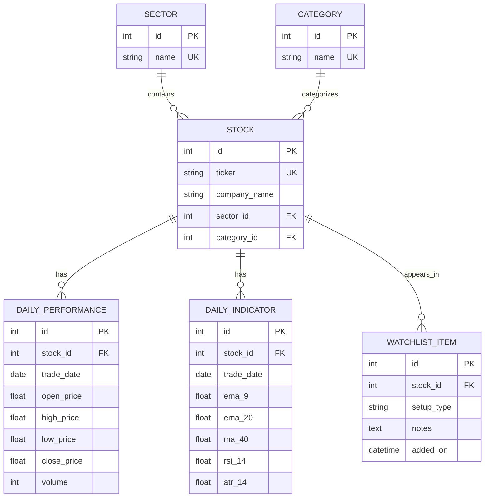

Project Roadmap: DSE Trading Agent \& Admin Dashboard

Phase 1: Foundation \& Environment (Current Phase)

\[ ] Set up local Python virtual environment (venv).

\[ ] Install required libraries (Flask, Flask-SQLAlchemy, Flask-Admin, Flask-Login, bdshare).

\[ ] Create the project directory structure.

Phase 2: Database Architecture (The Brain)

\[ ] Initialize the application factory (\_\_init\_\_.py).

\[ ] Build the models.py schema (Stock table, Alert table, User table).

\[ ] Run the initial database migration to create the SQLite app.db file.

Phase 3: The Admin Portal (Control Center)

\[ ] Configure Flask-Login to secure the admin area.

\[ ] Set up the first Admin User (username/password).

\[ ] Implement Flask-Admin to create the UI for managing Stocks (Categories, Watchlists) and Alerts.

Phase 4: The Core Agent Integration (The Engine)

\[ ] Refactor the existing 5-minute DSE data scraper (agent.py).

\[ ] Connect the agent directly to the SQLite database.

\[ ] Implement the "Structural Reclaim" logic to write new signals directly to the Alert table.

Phase 5: The User Dashboard (The Views)

\[ ] Build the core web routes (routes.py) to query the database.

\[ ] Create the "Super Hot" and "Breakout" watchlist pages.

\[ ] Design the frontend HTML/CSS using PicoCSS (templates/index.html).

Phase 6: Cloud Deployment (Production)

\[ ] Provision a free Google Cloud Platform (GCP) instance.

\[ ] Clone the repository to the server.

\[ ] Configure a Linux cron job to run the agent during DSE hours.

\[ ] Launch the Flask web server using a production WSGI server (like Gunicorn) and tmux.

