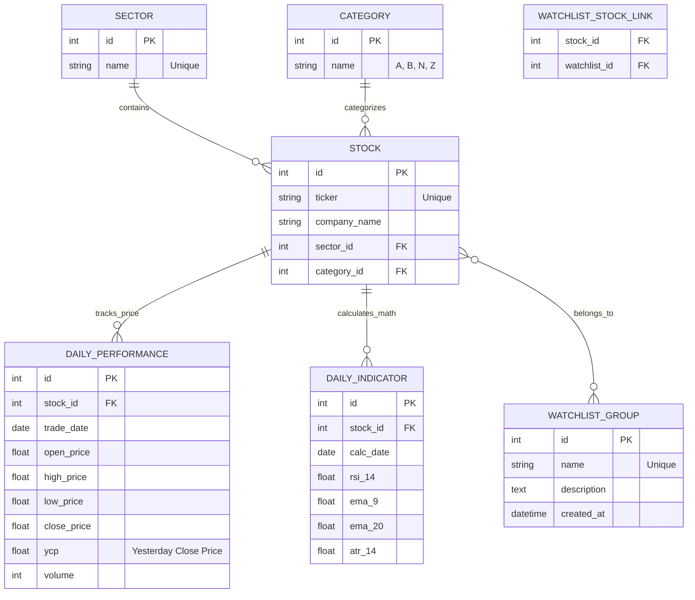

# DseScannerAgent - Database Architecture

This document outlines the SQLite database schema and entity relationships for the DseScannerAgent.

## Entity Relationship Diagram (ERD)

Core Tables
1. Structural Data
Sector: Master list of DSE sectors (e.g., Bank, Engineering).

Category: Master list of DSE trading categories (A, B, N, Z).

Stock: The core entity. Every stock belongs to exactly one Sector and one Category.

2. Market Data
DailyPerformance: Stores daily OHLCV (Open, High, Low, Close, Volume) data. Includes ycp for calculating daily change metrics. Enforces a Unique Constraint on (stock_id, trade_date) to prevent duplicate data.

DailyIndicator: Stores pre-calculated technical metrics (RSI, EMA) to ensure UI performance remains fast without recalculating on the fly.

3. User Configuration
WatchlistGroup: Defines custom technical setups or lists created by the user.

watchlist_stock_link: An invisible association table that allows a Many-to-Many relationship. This allows one Stock to exist in multiple Watchlists simultaneously without duplicating records.